<h3><code>harsh@github ~ $ ./contributions.sh</code></h3>

  

<h3><code>harsh@github ~ $ whoami</code></h3>

<table>
<tr>
<td valign="top">

</td>
</tr>
</table>

  

<h3><code>harsh@github ~ $ profile</code></h3>

<h1 align="center">This is me</h1>

<strong>
Name: Harsh Kumar (aka: Bankai or Harsh Singh)  
Interests: GPU, CPU, TPU, NPU and everything related to computer architecture.  
Likes: Experimenting with new LLMs, Backend Development, Linux and Open Source.
</strong>

## Hello!

> I'm a CS student who loves almost everything related to technology. I've had a deep interest in computers since childhood, starting with a Pentium G2020 paired with 4 GB of DDR3 RAM. I'm currently focused on improving my DSA and backend development skills, and I plan to dive deeper into RAG and AI systems later this year.

## Top Languages

## Stats

